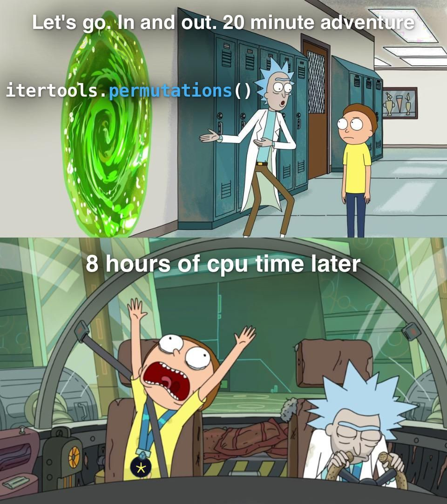
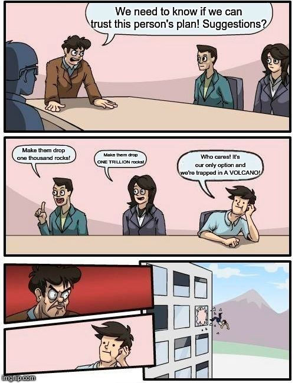
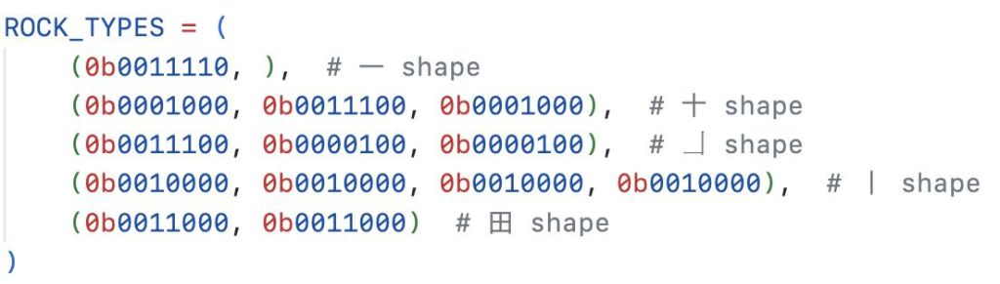
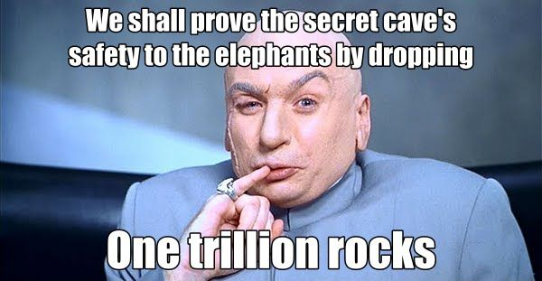

# Advent of Code - Memes collection

These are not my work. Source: [AoC subreddit](https://www.reddit.com/r/adventofcode)

<!---

### 2023 Day

*

[]()

-->

---

## 2023

### 2023 Day 3

* This genuinely makes no sense what the f**k is going on with my code

[](https://www.reddit.com/r/adventofcode/comments/189qyze/2023_day_3_this_genuinely_makes_no_sense_what_the/)

* This problem elf… are they Evil or Incompetent in your head canon?

[](https://www.reddit.com/r/adventofcode/comments/189s2qm/2023_day_03_this_problem_elf_are_they_evil_or/)

---

## 2022

### 2022 Day 5

* I heard you liked parsing

```txt
        C
        B
Q       A       E
  P     1     D
    8 ##### 2
    #########
O 7 ######### 3 F G
    #########
    6 ##### 4
        5     H
        L       I
        M         J
                    K
```

### 2022 Day 10

* Ok. Now you really need visualization

[](https://www.reddit.com/r/adventofcode/comments/zhkpio/2022_day_10_part_2_ok_now_you_really_need/)

### 2022 Day 12

* At least it was relatively fast

[](https://www.reddit.com/r/adventofcode/comments/zkfugb/2022_day_12_at_least_it_was_relatively_fast/)

### 2022 Day 14

* The biggest plot twist yet

[](https://www.reddit.com/r/adventofcode/comments/zm95wc/2022_day_14_the_biggest_plot_twist_yet/)

### 2022 Day 15

* Trust in your brute force

[](https://www.reddit.com/r/adventofcode/comments/zmqpmz/2022_day_15_part_2_trust_in_your_brute_force/)

### 2022 Day 16

* Finally got it at 11PM last night

[](https://www.reddit.com/r/adventofcode/comments/zottme/2022_day_16_finally_got_it_at_11pm_last_night/)

* The heat is O(n!)

[](https://www.reddit.com/r/adventofcode/comments/zojcow/2022_day_16_the_heat_is_on/)

* I paid for 16 cores, I will use 16 cores

[](https://www.reddit.com/r/adventofcode/comments/zohbcl/2022_day_16_i_paid_for_16_cores_i_will_use_16/)

* day 16...

[](https://www.reddit.com/r/adventofcode/comments/zob1cw/day_16/)

* Haha f ∉ O(2^n) go brrrrrrrrr

[](https://www.reddit.com/r/adventofcode/comments/zo6q3s/2022_day_16_haha_f_o2n_go_brrrrrrrrr/)

* Annual trip with the elves

[](https://www.reddit.com/r/adventofcode/comments/zni76u/2022_day_16_annual_trip_with_the_elves/)

* Suspension of disbelief is hard sometimes

[](https://www.reddit.com/r/adventofcode/comments/zn8l4d/2022_day_16_suspension_of_disbelief_is_hard/)

### 2022 Day 17

* Yep, 2 hard things

[](https://www.reddit.com/r/adventofcode/comments/zupn3t/2022_day_17_part2_yep_2_hard_things/)

* Optimizing...

[](https://www.reddit.com/r/adventofcode/comments/zozycr/2022_day_17_part_2_optimizing/)

* Leak from the elephant's group discussion

[](https://www.reddit.com/r/adventofcode/comments/zomdad/2022_day_17_leak_from_the_elephants_group/)

* When Han characters come in handy.

[](https://www.reddit.com/r/adventofcode/comments/zoi2b2/2022_day_17_when_han_characters_come_in_handy/)

* At least it'll be done before AoC 2023!

[](https://www.reddit.com/r/adventofcode/comments/zohdjr/2022_day_17_part_2_at_least_itll_be_done_before/)

* Is this Dr. Evil's volcano cave?

[](https://www.reddit.com/r/adventofcode/comments/zo3oy3/2022_day_17_part_2_is_this_dr_evils_volcano_cave/)

### 2022 Day 19

* So... I might have skipped a detail or two

[](https://www.reddit.com/r/adventofcode/comments/zpoxjl/2022_day_19_part_2_so_i_might_have_skipped_a/)

* I think I'll just lol-nope out of it

[](https://www.reddit.com/r/adventofcode/comments/zpnkbm/2022_day_19_i_think_ill_just_lolnope_out_of_it/)

* I don't even know what to expect anymore...

[](https://www.reddit.com/r/adventofcode/comments/zplodi/2022_day_19_part_2_i_dont_even_know_what_to/)

### 2022 Day 20

* Numbers are hard

[](https://www.reddit.com/r/adventofcode/comments/zrand8/2022_day_20_part_2_numbers_are_hard/)

* Getting your priorities straight

[](https://www.reddit.com/r/adventofcode/comments/zqqpgy/2022_day_20_part_2_getting_your_priorities/)

### 2022 Day 21

* The best plot twist ever!

[](https://www.reddit.com/r/adventofcode/comments/zrdbr4/2022_day_21_part_2_the_best_plot_twist_ever/)

* Let's not

[](https://www.reddit.com/r/adventofcode/comments/zrw49o/2022_day_21_part_2_lets_not/)

* Never knew Wolfram had a character limit

[](https://www.reddit.com/r/adventofcode/comments/zri6x5/2022_day_21_part_2_never_knew_wolfram_had_a/)

* No need for riddles when there's a language we both already speak...

[](https://www.reddit.com/r/adventofcode/comments/zrd8ei/2022_day_21_no_need_for_riddles_when_theres_a/)

* Thought this was going to be a quick one

[](https://www.reddit.com/r/adventofcode/comments/zrcuys/2022_day_21_thought_this_was_going_to_be_a_quick/)

### 2022 Day22

* Part 1 has a crazy map for input...

[](https://www.reddit.com/r/adventofcode/comments/zsoy7r/2022_day_22_i_loved_uredtwinkletoes_post_but/)

* Somehow it didn't come into play in part one

[](https://www.reddit.com/r/adventofcode/comments/zso4e5/day_22_part_2_somehow_it_didnt_come_into_play_in/)

* That was a shock

[](https://www.reddit.com/r/adventofcode/comments/zsijxj/2022_day_22_part_2_that_was_a_shock/)

* My advanced 3D debugger

[](https://www.reddit.com/r/adventofcode/comments/zsr4fa/2022_day_22_part_2_my_advanced_3d_debugger/)

### 2022 Day 23

* On second thought let's not go to 3 dimensions

[](https://www.reddit.com/r/adventofcode/comments/ztk9zw/2022_day_23_after_day_22_part_2/)

* Behold! The field in which I grow my starfruit

[](https://www.reddit.com/r/adventofcode/comments/ztqjao/2022_day_23_behold_the_field_in_which_i_grow_my/)

* The elves are fine; they're elastic

[](https://www.reddit.com/r/adventofcode/comments/zt94p5/2022_day_23_the_elves_are_fine_theyre_elastic/)

* Trees of Valinor

[](https://www.reddit.com/r/adventofcode/comments/zt8o4s/2022_day_23_trees_of_valinor/)

### 2022 Day 24

* Lord of the Elves

[](https://www.reddit.com/r/adventofcode/comments/zv8m1k/2022_day_24_part_2_lord_of_the_elves/)

* Dream Team

[](https://www.reddit.com/r/adventofcode/comments/zu6fk8/2022_day_24_part_2_dream_team/)

* Not sure why the elves are toddlers in my mind

[](https://www.reddit.com/r/adventofcode/comments/zu4utx/2022_day_24_part_2_not_sure_why_the_elves_are/)

### 2022 Day 25

* My experience this morning

[](https://www.reddit.com/r/adventofcode/comments/zv3rm0/2022_day_25_my_experience_this_morning/)

* Imagine being a young Rust program on Christmas morning, excited to .unwrap() your `Result`s for the `Ok(T)`s you wished for, only to be gifted `Err(E)`s instead.

[](https://www.reddit.com/r/adventofcode/comments/zuqzqr/2022_imagine_being_a_young_rust_program_on/)

---

## 2020

### 2020 Day 13

* Yes, I'm using brute force. Why you asking?

[](https://www.reddit.com/r/adventofcode/comments/kcuzmt/2020_day_13_part_2_yes_im_using_brute_force_why/)

---

## Generic

* How my GitHub typically looks like

[](https://www.reddit.com/r/adventofcode/comments/zvm6qj/how_my_github_typically_looks_like/)

* Living in Sweden during Advent of Code

[](https://www.reddit.com/r/adventofcode/comments/zut3h0/living_in_sweden_during_advent_of_code/)

* [2022 Day 26] Easy plans

[](https://www.reddit.com/r/adventofcode/comments/zuwk5l/2022_day_26_easy_plans/)

* Edge Cases?

[](https://www.reddit.com/r/adventofcode/comments/zuimxz/edge_cases/)

* Appreciation for the tireless moderation work

[](https://www.reddit.com/r/adventofcode/comments/zts118/appreciation_for_the_tireless_moderation_work/)

* Am I the only one?

[](https://www.reddit.com/r/adventofcode/comments/zte2uo/am_i_the_only_one/)

* So you're trying to get onto the leaderboard, huh?

[](https://www.reddit.com/r/adventofcode/comments/zjwovn/so_youre_trying_to_get_onto_the_leaderboard_huh/)

* Advent of code and having fun

[](https://www.reddit.com/r/adventofcode/comments/zrdsao/advent_of_code_and_having_fun/)

<!---
### 2023 Day

*

[]()

-->
